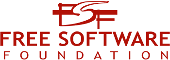
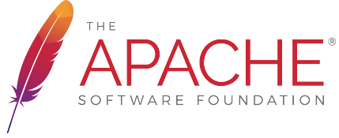

# Açık Kaynak

> Açık Kaynak nedir?

Açık kaynak Kodların herkes tarafından görülebilen ve lisans altında değiştirip yayınlamaya izin verir

> En çok kullanılan açık kaynak Lisanslar

1- GNU Genel Kamu Lisansı (GPL)
Free Software Foundation (Fırii softveyır foundeyşın) tarafından yazılan GPL lisansı guvendekal.org platformu dahil birçok yazılım, belge bu lisansı kullanmaktadır bu lisans dosyanın üzerinde şu haklara sahip olduğunuzu gösterir

- değiştirme hakkı:
dosyayı değiştirip yayınlamana olanak tanır ancak bazı koşullar altında

koşullar:
aynı hak ve yükümlülüklerle paylaşmak

2- Apache Lisansı
Apache Sotware Foundation (Apaçi Softveyır foundeyşın) tarafından yazılan Apache Lisansı genellikle Android Uygulamalarında kullanılan bir lisansdır

Haklar:
Apache Lisansı, yazılımın özgürce kullanılmasını, dağıtılmasını ve değiştirilmesini sağlar.

Kullanıcılar, yazılımı ticari veya ticari olmayan amaçlarla kullanabilirler.

Kullanıcılar, yazılımı değiştirebilir ve değiştirilmiş sürümlerini dağıtabilirler.

Kullanıcılar, yazılımın kaynak kodunu erişime açabilirler.

Yükümlülükler:
Kullanıcılar, Apache Lisansı'nın şartlarına uymak zorundadırlar.

Kullanıcılar, yazılımın kaynak kodunu değiştirdiklerinde, değiştirilmiş sürümlerini dağıtmadan önce Apache Lisansı'nın şartlarına uymak zorundadırlar.

Kullanıcılar, yazılımın dağıtımında Apache Lisansı'nın bir kopyasını eklemek zorundadırlar.

Kullanıcılar, yazılımın dağıtımında Apache Lisansı'nın şartlarına uymak zorundadırlar.

Kullanıcılar, yazılımın kaynak kodunu erişime açtıklarında, Apache Lisansı'nın şartlarına uymak zorundadırlar.

Diğer Hususlar:
Apache Lisansı, yazılımın garantisi veya sorumluluğu olmadığını belirtir.

Apache Lisansı, yazılımın patent veya telif hakkı ihlali olmadığını belirtir.

Apache Lisansı, yazılımın kullanımından doğan zararlardan sorumlu olmadığını belirtir.

3- MIT (Massachusetts Institute of
Technology)

MIT (Emayti) lisansı Scratch yazılımı ve başka birçok yazılımının lisansı olan MIT (Emayti) lisansının özellikleri şunlardır:

> Haklar:
MIT Lisansı, yazılımın özgürce kullanılmasını, dağıtılmasını ve değiştirilmesini sağlar.

Kullanıcılar, yazılımı ticari veya ticari olmayan amaçlarla kullanabilirler.

Kullanıcılar, yazılımı değiştirebilir ve değiştirilmiş sürümlerini dağıtabilirler.

Kullanıcılar, yazılımın kaynak kodunu erişime açabilirler.

> Yükümlülükler:
Kullanıcılar, MIT Lisansı'nın şartlarına uymak zorundadırlar.

Kullanıcılar, yazılımın dağıtımında MIT Lisansı'nın bir kopyasını eklemek zorundadırlar.

Kullanıcılar, yazılımın kaynak kodunu erişime açtıklarında, MIT Lisansı'nın şartlarına uymak zorundadırlar.

Kullanıcılar, yazılımın değiştirilmiş sürümlerini dağıttıklarında, değiştirilmiş sürümlerin kaynak kodunu erişime açmak zorundadırlar.

>Diğer Hususlar:

MIT Lisansı, yazılımın garantisi veya sorumluluğu olmadığını belirtir.

MIT Lisansı, yazılımın patent veya telif hakkı ihlali olmadığını belirtir.

MIT Lisansı, yazılımın kullanımından doğan zararlardan sorumlu olmadığını belirtir.
