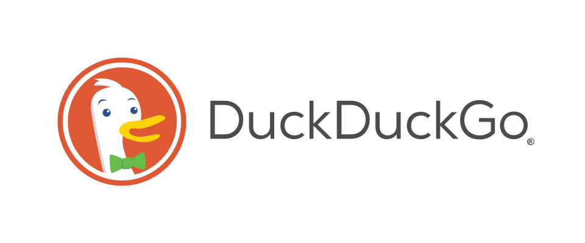

# Arama Motorları

Arama motoru, internet üzerinde aramalarınıza göre size sonuçlar sunan araçlardır. Arama motoru sorgunuzu, veritabanındaki indekslediği sitelerde arar ve uygun sonuçları listeler.

Arama motorları kullanıcılarının arama sorgularına, IP adreslerine, konumlarına ulaşabilir. Kullanıcılarının aramalarına ve davranışlarına göre kişiselleştirilmiş reklamlar sunabilirler.

!> Kullanıcıların ilgi alanları, geçmiş davranışlarını analiz ederek kişiselleştirilmiş reklamlar sunan arama motorlarından uzak durmanızı öneririz. 

Ana gelir kaynağı "kişiselleştirilmiş reklam" olan arama motorları, sıralamada reklam verenler daha üst sıralara taşımaktadır. Buda kullanıcının doğru ve tarafsız bir arama sonucuna ulaşmasına engel olmaktadır.

Bu nedenlerle sizin verilerinizi işleyip kullanan, aramalarda manipülasyon yapan arama motorlarunu kullanmamanız; [**gizlilik**](https://guvendekal.org/#/gizlilik) ve [**mahremiyetiniz**](https://guvendekal.org/#/mahremiyet) başta olmak üzere daha doğru arama sonuçlarına ulaşmanız için önemlidir.

### Önerilenler Tablosu

| Arama Motoru     | Açık Kaynak       |  Kayıt Tutma     | Kayıtlı Ülke | Sonuçların Kaynağı | Reklamlar  |       
| ---------------- |:----------------:| :---------------:| :------------:| :----------------:| :---------:| 
| StartPage         | × | ✓     | Hollanda     | Google           | ×      |
| DuckDuckGo        | × | × | ABD          | Kendi + Bing     | ✓       |
| Brave Search      | × | × | ABD          | Kendi indeksi    | ✓      |
| Searx             | ✓ | × | Bağımsız | Meta Arama | ×      |

* StartPage anonim, tanımlanamaz kayıt tutmaktadır.
* Searx, meta bir aramo motorudur. Farklı arama motorlarının sonuçlarını göstermektedir.
* DuckDuckGo'nun arama motoru kapalı kaynaktır. Ancak bazı istemcileri açık kaynaktır, [**buradan**](https://duckduckgo.com/duckduckgo-help-pages/open-source/opensource-overview/) kontrol edebilirsiniz.
* DuckDuckGo ve Brave Search'in kullanıcılarına sunduğu reklamlar, kapatılabilmektedir. Aynı zamanda kullanıcıların veri ve davranışlarını analiz edip reklam göstermez.

### StartPage

### DuckDuckGo

### Brave Search

### Searx

