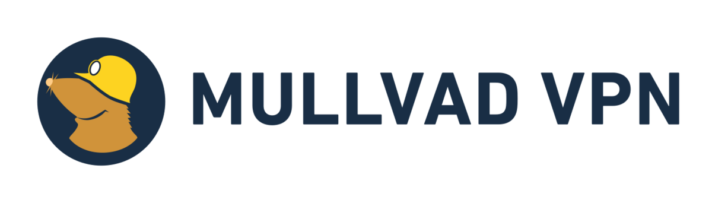
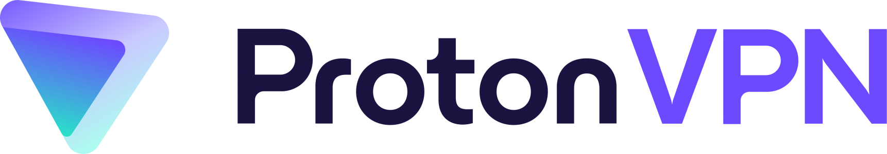

<!-- NOTLAR
 - Bu içerik halihazırda yazılmıştır. İçerik içinde ekleme yapma yada düzeltme yapma ihtiyacı yoksa değişiklik yapmanız önerilmez. Uygulama önerilerine ekleme yapmak isterseniz, eklenen diğer uygulamaların kalitesinde olmasına özen gösteriniz.
 - Bu içeriğe eklenmesi gereken şeyler olduğu düşünülmektedir. https://github.com/GuvendeKal/guvendekal.org/issues/28 buradan bakabilirsiniz.
 - Tablo eklemeyi unutmayın
 - Uygun görseller eklemeyi unutmayın.
 - İçerik kuralları ve ekleme yapmak sayfalarını ziyaret edebilirsiniz -->

# VPN

**VPN**, internet üzerinde internet bağlantınızın güvenliğini ve gizliliğinizi korumanıza yardımcı olan bir araçtır. VPN'in temel mantığı kullanıcıların internet trafiğini şifreleyerek uzakta bulunan başka bir sunucuya yönlendirmesidir.

VPN'in kullanım amacı kullanıcıdan kullanıcıya değişse de, genel kullanım amaçları olarak IP adresini gizlemek, anonimlik sağlamak, yasaklamaları aşmak, daha güvenli bir internet bağlantısına erişmek gibi nedenler sayılabilir.

VPN kullandığınızda trafiğinizi (ziyaret ettiğiniz siteleri) internet servis sağlayıcınızdan gizlersiniz, internet sitelerine kendi IP adresinizi vermemiş olursunuz ancak kullandığınız VPN servisi bu bilgilere erişebilir.

!> VPN seçerken, gizlilik ve veri güvenliği adına hizmet veren bir platformu seçtiğinizden emin olun! Ücretsiz VPN servislerinden uzak durmanızı- en azından felsefesini bilmediklerinizden - ve ücretsiz olma sebeplerinin arkasında duran gerçekleri bilmenizi diliyoruz.

## Önerilenler Tablosu

| VPN | Kayıt Tutuyor mu | Açık Kaynak | Ülke | Sunucu Sayısı | Platformlar | Fiyat |
| --- | :---: | :---: | :---: | :---: | :---: | :---: |
|    Mullvad VPN | × | ✓ | İsveç | 650+ | <i class="fa-brands fa-windows"></i> <i class="fa-brands fa-apple"></i> <i class="fa-brands fa-linux"></i> <i class="fa-brands fa-android"></i> <i class="fa-brands fa-app-store-ios"></i> | Aylık 5 € |
|    Proton VPN | × | ✓ | İsviçre | 6,900+ | <i class="fa-brands fa-windows"></i> <i class="fa-brands fa-apple"></i> <i class="fa-brands fa-linux"></i> <i class="fa-brands fa-android"></i> <i class="fa-brands fa-app-store-ios"></i> | Ücretsiz\* |

- ProtonVPN'in ücretli sürümü aylık 9.99€'dan başlamaktadır. Ücretsiz sürümde sınırlı sayıda ülke ve sunucu sayısı olabilir.

## Mullvad VPN

[**Mullvad VPN**](https://mullvad.net/en), gizliliği ile ön plana çıkaran bir VPN hizmetidir. Hesap oluşturmak için e-posta yada kullanıcı adı gerekmez. Hesap oluşturulduğu an 16 haneli bir hesap numarası verilir ve hesaba bu numara ile giriş yapılır.

Bu sayede kullanıcıların herhangi bir bilgisinin kaydıda tutulmaz. Mullvad VPN, kullanıcılarının hiç bir kaydını (IP, konum vs) tutmamaktadır. Mullvad VPN istemcileri de açık kaynaklıdır. Mullvad VPN kullanıcılarına karşı şeffaf, mahremiyet ve güvenliklerini önemseyen bir VPN servisidir.

> 2023 yılında İsveç polisi tarafından Mullvad VPN sunucularına erişilmeye çalışıldı ancak kayıt tutulmadığı için kullanıcı bilgileri İsveç polisinin eline geçmedi. [Kaynak1](https://www.pcmag.com/news/mullvad-vpn-hit-with-search-warrant-in-attempted-police-raid) [Kaynak2](https://www.theverge.com/2023/4/21/23692580/mullvad-vpn-raid-sweden-police)

<table>
 <tr>
 <th colspan="2">Mullvad VPN Detayları</th>
 </tr>
 <tr>
 <td>Kayıt Tutuyor mu?</td>
 <td>×</td>
 <tr>
 <td>Açık Kaynak</td>
 <td>✓</td>
 </tr>
 <tr>
 <td>Kill Switch</td>
 <td>✓</td>
 </tr>
 <tr>
 <td>DNS Sızıntı Koruması</td>
 <td>✓</td>
 </tr>
 <tr>
 <td>Split Tunneling</td>
 <td>✓</td>
 </tr>
 </tr>
 <tr>
 <td>Kayıtlı Ülke</td>
 <td>İsveç</td>
 </tr>
 <tr>
 <td>Şifreleme Protokolleri</td>
 <td>WireGuard, OpenVPN</td>
 </tr>
 <tr>
 <td>Sunucu Sayısı</td>
 <td>650+ Sunucu</td>
 </tr>
 <tr>
 <td>Platform Desteği</td>
 <td><i class="fa-brands fa-windows"></i> <i class="fa-brands fa-apple"></i> <i class="fa-brands fa-linux"></i> <i class="fa-brands fa-android"></i> <i class="fa-brands fa-app-store-ios"></i> </td>
 </tr>
 <tr>
 <td>Ödeme Seçenekleri</td>
 <td>Kredi Kartı, Bitcoin, Nakit</td>
 </tr>
 <tr>
 <td>Cihaz Sayısı</td>
 <td>5 Cihaz</td>
 </tr>
</table>

- [Açık kaynak depoları](https://github.com/mullvad/mullvadvpn-app)
- [Gizlilik politikaları](https://mullvad.net/en/help/privacy-policy)

## Proton VPN

[**ProtonVPN**](https://protonvpn.com/), kullanıcı gizliliğini ön planda tutan bir VPN hizmetidir. İsviçre merkezli olan ProtonVPN, güçlü şifreleme yöntemleri ve sıkı bir sıfır kayıt politikası ile kullanıcı verilerini korur.

Proton firmasının pek çok farklı uygulaması mevcuttur, örn: Proton Mail, Proton Calender, Proton Drive, Proton Pass, Proton Wallet. Proton ekosistemini kullanmak isterseniz, VPN ile ortak alıp kullanabilirsiniz, daha hesaplı olabilir.

<table>
 <tr>
 <th colspan="2">Proton VPN Detayları</th>
 </tr>
 <tr>
 <td>Kayıt Tutuyor mu?</td>
 <td>×</td>
 </tr>
 <tr>
 <td>Açık Kaynak</td>
 <td>✓</td>
 </tr>
 <tr>
 <td>Kill Switch</td>
 <td>✓</td>
 </tr>
 <tr>
 <td>DNS Sızıntı Koruması</td>
 <td>✓</td>
 </tr>
 <tr>
 <td>Split Tunneling</td>
 <td>✓ <small>(Premium sürümde)<small></td>
 </tr>
 <tr>
 <td>Kayıtlı Ülke</td>
 <td>İsviçre</td>
 </tr>
 <tr>
 <td>Şifreleme Protokolleri</td>
 <td>OpenVPN, IKEv2, WireGuard</td>
 </tr>
 <tr>
 <td>Sunucu Sayısı</td>
 <td>6,900+ Sunucu</td>
 </tr>
 <tr>
 <td>Platform Desteği</td>
 <td><i class="fa-brands fa-windows"></i> <i class="fa-brands fa-apple"></i> <i class="fa-brands fa-linux"></i> <i class="fa-brands fa-android"></i> <i class="fa-brands fa-app-store-ios"></i> </td>
 </tr>
 <tr>
 <td>Ödeme Seçenekleri</td>
 <td>Kredi Kartı, Bitcoin, PayPal</td>
 </tr>
 <tr>
 <td>Cihaz Sayısı</td>
 <td>1 Cihaz (Ücretsiz), 10 Cihaz (Premium)</td>
 </tr>
</table>

- [Açık kaynak depoları](https://github.com/ProtonVPN)
- [Gizlilik politikaları](https://protonvpn.com/privacy-policy)
